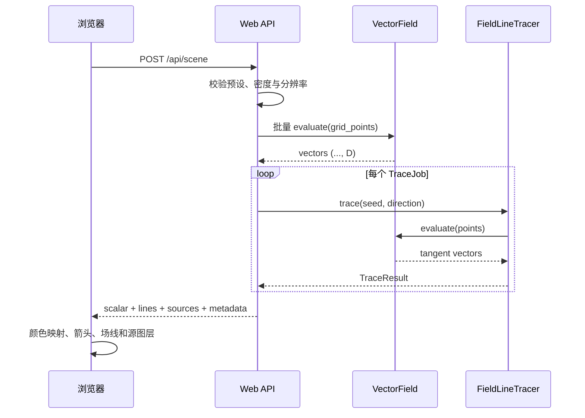

# 系统架构

VectorViz 使用 `src` 布局，并通过稳定的小接口连接物理、积分、服务与前端。依赖方向只能从外层指向内层：核心模型不得导入 Web 框架或绘图库。当前核心保持为几个小模块；当网格场、导入器和相对论动力学落地后，再按领域拆成子包。

## 目录结构

```text
Vector_field_streamline/
├── pyproject.toml
├── mkdocs.yml
├── docs/
├── notebooks/                  # Jupyter 教程与可复现实验
├── src/
│   └── vectorviz/
│       ├── __init__.py          # 稳定公共导出
│       ├── core.py              # VectorField、Domain、排除几何
│       ├── fields.py            # 解析场与组合场
│       ├── tracing.py           # 自适应场线积分与结果类型
│       └── web/
│           ├── app.py           # HTTP API 与静态资源入口
│           ├── schemas.py       # 请求/响应契约
│           ├── seeding.py       # Web 预设的 TraceJob 播种策略
│           └── static/          # 无构建浏览器前端
└── tests/                       # 单元、验证、Web 契约测试
```

模块可以在保持下述依赖边界的前提下继续拆分。

## 分层与职责

| 层 | 负责 | 不负责 |
|---|---|---|
| `core.py` | 接口、区域、排除几何和共享数组约定 | 具体物理模型、HTTP、绘制 |
| `fields.py` | 批量求值解析场与组合场 | 播种、积分、颜色映射 |
| `tracing.py` | 方向归一化、双向积分、事件、终止信息 | 物理源公式、浏览器状态 |
| 验证代码 | 解析解、不变量、残差与收敛诊断 | 修改模型参数以“修好”结果 |
| `web/` | 输入校验、预设播种、场景编排、静态资源、JSON 序列化 | 修改核心物理公式、把数值算法复制到前端 |
| 前端 | 参数交互、图层和提示信息 | 物理公式与积分算法 |

## 核心数据流



API 返回数值与科学元数据，而不返回预先栅格化的截图。这样前端可在不重复求解的情况下切换图层、调整颜色或查看探针。

## 核心抽象

### `VectorField`

所有场实现都遵守一个批量接口：

```python
vectors = field.evaluate(points)
```

- `points` 的形状是 `(..., dimension)`；
- 返回值形状与 `points` 相同；
- 计算使用浮点数组，不能静默把结果截断为整数；
- 无效点应通过明确异常、mask 或非有限值政策处理；
- 实现不得根据当前色图或相机改变结果。

解析场、数值积分场、规则网格插值场和组合场都通过这一接口进入积分器。

### `Domain`

`Domain` 描述积分允许进入的空间范围，并为越界事件提供单一事实来源。几何源的排除区域通过 `ExclusionRegion` 的 signed margin 进入积分事件：点源使用圆形/球形排除，圆导线使用三维环面排除。排除半径属于追踪与 mask 几何，不改写理想源公式；不要把“离开计算域”和“命中奇点”混成同一个终止原因。

### `TraceResult`

轨迹结果至少保存：

- 按顺序排列的坐标点；
- 正向、反向或双向信息；
- 每个分支的终止原因；
- 弧长或积分参数；
- 可选的场强、误差估计和诊断元数据。

渲染器消费 `TraceResult`，不调用积分器内部方法。

## Web 适配层

Web 层把用户友好的预设名称转换成核心对象：

```text
electric_dipole -> PointChargeField(批量异号电荷)
magnetic_dipole -> MagneticDipoleField(...) 的 z=0 不变平面适配器
halbach_array    -> 单个批量 MagneticDipoleField（默认八个点偶极源）的可编辑组合
current_loop    -> CircularLoopField(...) 的 z=0 子午面适配器
charged_ring    -> ChargedRingField(...) 的 z=0 子午面适配器
uniform         -> UniformField(...)
```

`resolution` 控制标量背景采样；`density` 控制播种数量或间距。这两个参数不能互相代替。完整 JSON 契约见 [HTTP API](api.md#http-api)。

`web/seeding.py` 把每个预设的种子位置、追踪方向和可选源下标封装为不可变 `TraceJob`。它只组合核心公开接口：圆环等 $\psi$ 策略调用 `CircularLoopField.flux_function()` 并用 SciPy 求根，不在 Web 层复制圆环磁场公式。`scene.py` 统一执行 job、组织双端终止信息，并在所有结果已知后做电荷源对抑制；抑制属于展示编排，不改写积分器或尝试预算。

磁偶极与 Halbach 场景都只把 HTTP 中的面内角度转换成三维磁矩，再复用核心的批量 `MagneticDipoleField`；Web 层不复制磁偶极公式。单个 active 磁偶极沿旋转赤道线生成 `BOTH` job；多个 active 偶极使用逐源外向半球覆盖。Halbach 默认几何由八个等间距点偶极组成，相邻方向转过 90°，其专用 `BOTH` job 位于 $y=\pm0.45$ m 两条轨道。用户编辑后它成为普通的可编辑面内偶极阵列，退回逐源覆盖，响应元数据也不再把任意排列冒充标准 Halbach 几何。

圆环是三维理想细导线模型；二维 Web 追踪器使用它的真实不变子午面。三维环面排除管在该平面上的截面是两个圆盘，因此 Web 层传给二维追踪器的是两个 `SphericalExclusion`，而不是维数不匹配的 `ToroidalExclusion`。响应中的两个 wire 标记仅表示同一圆环与子午面的交点，不是两个独立场源。环内非轴 job 由等间隔 $\psi$ 目标反解并成对镜像，奇数预算另含一条轴线特征 job。带电圆环复用同一个子午面适配器和同样的两个圆盘排除区，种子改在两个截面周围的种子圆上按等间隔 $\Psi$ 反解角度并镜像；零通量目标直接放在环内赤道上，奇数预算另含一条环外赤道射线。

## 缓存边界 { #cache-boundaries }

缓存设计上分为三层，各用彼此独立的键：

1. **场采样**：模型、物理参数、区域和采样网格；
2. **曲线**：模型、物理参数、区域、种子、积分选项和终止政策，不含采样网格；
3. **显示**：视口、色图、线宽、图层可见性和相机。

改变显示状态不使前两层失效；只改 `resolution` 只使场采样失效；改变播种预算只使曲线失效；改变源集合、源强、源位置或偶极矩方向角使前两层都失效。

目前服务端实现的是曲线层。`scene.py` 以去掉 `resolution` 的请求 JSON 为键，在进程内保留最近使用的至多 32 份追踪结果，并以估计 64 MiB 为内存上限；一个预设场景的曲线约 0.1–0.5 MB，实际起约束作用的是条数上限。命中时使用同一键下算出的结果，并给每个响应复制一份场线，调用方修改响应不会影响缓存，因此命中与重新追踪得到相同的响应。缓存随进程重启清空，所以键中不需要求解器版本。场采样层没有缓存，标量网格每次重新采样，耗时远小于追踪；显示状态只存在于浏览器。

## 扩展点

### 数值网格场

规则网格可由 `RegularGridField` 封装；非结构网格应保留单元拓扑，并在单元内插值。导入器将 FEMM、VTK 或测量数据转换成统一场接口，而不是让积分器依赖某种文件格式。

### 粒子与相对论轨迹

普通场线状态只有位置；带电粒子状态至少包括位置与速度；Kerr 光线状态包括四维位置与四动量。未来应抽象为通用 `Dynamics`：

```python
derivative = dynamics.rhs(parameter, state)
position = dynamics.position(state)
```

它们可以共享事件、曲线数据和渲染器，但不能都实现成 `VectorField`。原因和方程见[引力场与黑洞光线](tutorial/05-gravity-and-rays.md)。

## 架构约束的测试

集成测试至少应证明：

- 同一场对象既能批量采样，也能进入追踪器；
- Web 端点只通过公共 API 构建场，不访问私有积分细节；
- JSON 中的点、标量尺寸与 `domain` 一致；
- 改变前端显示选项不会改变核心轨迹坐标；
- Python 包可在仓库根目录之外导入，防止假安装掩盖 `src` 布局问题。

参见[开发指南](development.md)了解测试组织和提交检查。
