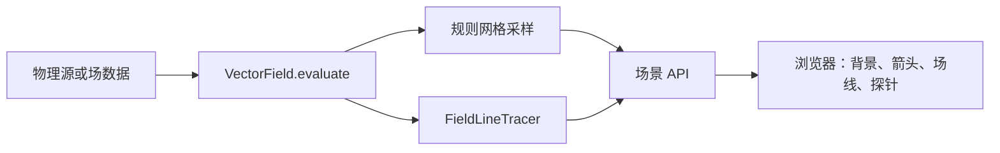

# VectorViz

VectorViz 用 Python 计算向量场和场线，并在浏览器中显示结果。场公式只实现一次：同一个场对象用于批量采样、数值追踪和测试，前端热图、箭头与探针也读取它的结果。

当前版本可以在浏览器中查看电偶极子、理想磁偶极子和匀强场。源可以拖动，场线和背景会重新计算；图中同时显示单位、播种方式、切片含义和终止统计。

## 第一次使用

1. 跟着[快速开始](getting-started.md)用 uv 安装并启动服务。
2. 打开浏览器前端，先比较三个内置预设。
3. 阅读[场线是什么](tutorial/01-field-lines.md)，再看[切片、播种与验证](tutorial/04-slices-and-validation.md)。这两章解释图上的线能说什么、不能说什么。
4. 要添加模型时，从[从物理源到向量场](tutorial/02-field-models.md)和[开发指南](development.md)开始。

其他文档：

- [物理与数学建模教程](physics-and-numerics.md)
- [系统架构](architecture.md)
- [Python 与 HTTP API](api.md)
- [参考资料](references.md)

## 场景数据如何生成



浏览器不重复实现库仑场、磁偶极公式或 ODE。更换色图不需重算场，更换种子不需重建模型；只有源的位置变化时，已有场值才失效。

## 看图前先确认四件事

1. **曲线类型**：是真实场线、投影流线，还是三维曲线的二维投影？
2. **颜色含义**：画的是完整场强、平面内场强，还是某个带符号分量？
3. **种子来源**：线条是为画面均匀而放，还是每条代表相同通量？
4. **空白区域**：是场为零、源的奇点 mask，还是计算域之外？

!!! warning "场线不是粒子轨迹"
    场线只要求曲线切向与场方向一致。带电粒子还需要质量和初速度；黑洞光线是四维时空中的零测地线。三者可以共用部分数值工具，但不能共用同一条动力学方程。

## 启动

```powershell
uv sync
uv run vectorviz
```

前端位于 <http://127.0.0.1:8000>。文档预览使用另一个端口：

```powershell
uv run mkdocs serve
```

打开 <http://127.0.0.1:8001>。两个服务可以同时运行。
