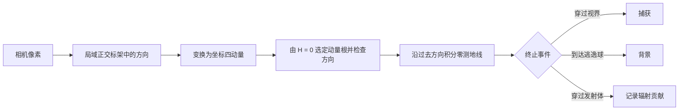

# 5. 引力场与黑洞光线

牛顿引力可以画场线；黑洞附近的光不能叫“沿引力场线运动”。两者都能画成曲线，但状态、方程和物理含义不同。

!!! note "当前状态"
    相对论模块尚未实现。本章说明模型边界以及后续的开发与验证步骤，不是现有 API 说明。

## 先把视频拆开

本章分析的视频长 30 分 29 秒。它不是从头到尾都在做同一种计算，而是把六层内容接在了一起：

| 时间 | 画面在讲什么 | 本项目应怎样处理 |
| --- | --- | --- |
| 00:27–07:44 | 等效原理、度规和测地线 | 作为物理导入，不直接变成代码 |
| 07:45–17:25 | Schwarzschild 度规和光线轨道方程 | 先做可验证的 Schwarzschild 参考实现 |
| 17:26–23:34 | 从相机反向发射光线、映射背景 | 做成相机、观察者标架和捕获/逃逸分类 |
| 23:35–26:57 | 薄吸积盘、直接像和高阶像 | 增加盘面交点，和测地线积分分开 |
| 26:58–28:04 | Doppler 增亮与引力频移 | 用四动量和发射体四速度计算，不能只调颜色 |
| 28:05–结尾 | 与 M87\* 图像并排比较 | 只能称定性比较；EHT 观测还有一整层射电干涉成像 |

这条路线可以在本项目里实现，但“能画出类似的橙色圆环”和“复现 M87\* 观测”是两个目标。前者是相对论光线追踪加一个简化发射模型；后者还要模拟磁化等离子体、230 GHz 辐射传输、望远镜基线采样和图像重建。[^eht-i][^eht-iv][^eht-v]

### 视频里的“等效偏折加速度”

视频没有把完整的八维测地线方程直接塞进 Blender。它先取 Schwarzschild 光线的平面轨道，令

$$
m=\frac{GM}{c^2},
\qquad
u=\frac1r,
$$

得到

$$
\frac{d^2u}{d\phi^2}+u=3mu^2.
$$

再把同一条空间曲线写成一个便于逐步画线的中心力形式：

$$
\frac{d^2\mathbf r}{d\lambda^2}
=-3m\,\frac{h^2}{r^5}\mathbf r,
\qquad
h=\left\lVert\mathbf r\times
\frac{d\mathbf r}{d\lambda}\right\rVert.
$$

这不是“光子受到了一种新的牛顿力”。它是 Schwarzschild 零测地线轨道方程的一种改写；在球对称情形下，每条光线都落在一个平面内，所以很适合做教学渲染。把 Schwarzschild 光线写成等效中心力系统也可见于专门的动力系统分析。[^belbruno]

它的边界很清楚：

- 它保存的是 Schwarzschild 坐标中的空间轨迹形状，不包含坐标时间和光子频率；
- 它不能靠“再加一项力”自然推广到 Kerr，也不能表示参考系拖曳；
- 视频采用“方向前进一步，再归一化”的显式离散更新。步长趋于零时可以逼近目标曲线，但固定步长没有误差估计，临界光线绕行越多越需要做步长收敛；
- `h` 是这套轨道参数化中的守恒量，不是“光子的能量”。光子仍有 $E=-p_t$；只看无参数曲线时，整体缩放四动量不会改变路径。

因此，本项目可以保留这条三维等效轨道作为一个**教学后端**，但科学基准应使用后文的 Hamilton 零测地线系统。两者必须通过同一组结果核对：弱场偏折 $4GM/(bc^2)$、光子球 $r=3m$ 和临界冲量参数 $b=3\sqrt3m$。

### 几句需要改写的话

这些不是术语洁癖。每一条都会改变代码里的状态量、方程或测试。

| 视频中的说法 | 更准确的说法 |
| --- | --- |
| “$G$ 是时空的硬度” | $G$ 是有量纲的引力耦合常数。脱离单位和尺度，仅比较数值大小没有“更硬、更软”的意义。 |
| “令逃逸速度等于 $c$，得到黑洞半径” | 牛顿计算碰巧给出 $2GM/c^2$，可作记忆；事件视界来自 Schwarzschild 时空的因果结构，不是牛顿力学推导。 |
| “$ds^2=0$ 的路径就是光路” | $ds^2=0$ 只说明曲线是 null；自由光线还要满足零测地线方程和初始条件。 |
| “测地线是最短路径” | 在洛伦兹时空中应说作用量取驻值。类时自由落体局部通常最大化固有时；零测地线的固有时恒为零。[^tong-gr] |
| “分母是 $r^5$，所以引力按五次方增长” | 式子还乘了 $\mathbf r$；固定 $h$ 时向量模约为 $r^{-4}$。更重要的是，这只是特定参数下的等效轨道方程。 |
| “光速不变，能量体现在角动量上” | $E=-p_t$ 与 $L$ 是独立守恒量；无参数光路常由它们的比值 $b=L/E$ 决定。 |
| “引力红移造成阴影” | 捕获与逃逸的分界给出阴影几何；红移改变收到的频率和强度。 |
| “黑洞就是无限弯曲的奇点” | 黑洞是含事件视界的时空区域。奇点是经典解内部的病态边界，不能与整个黑洞画等号。 |

## 牛顿引力仍是普通向量场

点质量 $M$ 位于原点时，

$$
\Phi(r)=-\frac{GM}{r},
\qquad
\mathbf g(\mathbf x)
=-GM\frac{\mathbf x}{r^3}.
$$

场线满足

$$
\frac{d\mathbf x}{ds}
=\frac{\mathbf g}{\lVert\mathbf g\rVert},
$$

所以是指向质量的径向直线。多个点质量的场可线性叠加。[^openstax-gravity]

这仍然不是物体轨道。物体运动满足

$$
\frac{d^2\mathbf x}{dt^2}=\mathbf g(\mathbf x,t),
$$

还需要初速度。同一点只有一个牛顿引力场方向，却可以有无数条不同速度的轨道经过。把径向场线和椭圆轨道画在同一幅图上，是最直接的反例。

在无旋静态区域，$\mathbf g=-\nabla\Phi$。沿非零引力场线有

$$
\frac{d\Phi}{ds}
=\nabla\Phi\cdot\frac{\mathbf g}{\lVert\mathbf g\rVert}
=-\lVert\mathbf g\rVert<0,
$$

因此这样的牛顿引力场线不会闭合。

## 广义相对论换掉了什么

广义相对论用时空度规 $g_{\mu\nu}$ 描述几何。光沿零测地线传播，局部满足

$$
ds^2=g_{\mu\nu}dx^\mu dx^\nu=0.
$$

一条光线的状态不再只有三维位置，而是

$$
y=(x^\mu,p_\mu),
$$

即四维位置与四动量。同一个空间点可以有许多不同动量的光线经过，所以不存在一个普通的 `VectorField(position) -> direction` 能表示所有黑洞光线。

因此，现有 `FieldLineTracer` 不能直接追踪 Kerr 光线。事件处理、曲线数据和渲染器仍可复用，但需要另建动力学对象。

## 用 Hamilton 方程追光

采用几何单位 $G=c=1$，定义

$$
H(x,p)=\frac12g^{\mu\nu}(x)p_\mu p_\nu.
$$

光线满足 $H=0$，Hamilton 方程为

$$
\frac{dx^\mu}{d\lambda}
=\frac{\partial H}{\partial p_\mu}
=g^{\mu\nu}p_\nu,
$$

$$
\frac{dp_\mu}{d\lambda}
=-\frac{\partial H}{\partial x^\mu}
=-\frac12\frac{\partial g^{\alpha\beta}}{\partial x^\mu}
p_\alpha p_\beta.
$$

$\lambda$ 是仿射参数。这个一阶系统在八维相空间中演化，输入必须同时包含位置和动量；EinsteinPy 的零测地线接口也采用这种状态。[^einsteinpy]

## 先做 Schwarzschild，再做 Kerr

直接从旋转黑洞开始，出现异常时很难判断是坐标、相机或积分器有误，还是参考系拖曳（frame dragging）造成的物理效应。Schwarzschild 时空提供两个适合验证实现的已知结果：

$$
r_{\mathrm{ph}}=3M,
\qquad
b_{\mathrm{crit}}=3\sqrt3\,M.
$$

$r_{\mathrm{ph}}$ 是光子球半径，$b_{\mathrm{crit}}$ 是无穷远观察者的临界冲量参数。[^synge][^perlick] 它们与视界半径 $2M$ 不是同一个量。

换成视频使用的 Schwarzschild 半径 $r_s=2M$，三个尺度分别是

$$
r_+=r_s,
\qquad
r_{\mathrm{ph}}=1.5r_s,
\qquad
b_{\mathrm{crit}}=\frac{3\sqrt3}{2}r_s\approx2.598r_s.
$$

它们不能都叫“黑洞边缘”：

- **事件视界**是因果边界；
- **光子球**是 Schwarzschild 时空中不稳定圆形零测地线组成的球面；
- **临界曲线**是远处观察者屏幕上的捕获边界；
- **阴影**是背景和发射模型共同照亮时，临界曲线以内形成的暗区；
- **光子环**指经历多次近临界绕行的高阶像，不是任意一圈亮边。[^gralla]

“爱因斯坦环”又是另一件事。它需要背景源、透镜和观察者近似共线；倾斜薄盘被弯成上下两层，不应自动叫爱因斯坦环。

这里 $b=L/E$，$E$ 是无穷远处的光子能量，$L$ 是总角动量。球对称性允许把每条光线转到一个平面内讨论。

对从无穷远处向内入射的光线，先完成三个实验：

1. $b<b_{\mathrm{crit}}$ 的向内分支被捕获；
2. $b>b_{\mathrm{crit}}$ 的光线经过近地点后逃逸；
3. 临界光线逐渐靠近 $r=3M$，并在多组积分容差下量化轨迹变化。

只有这三项稳定后，再把度规换成 Kerr。

## Kerr 模型多了什么

Kerr 1963 年给出了旋转质量的真空时空解。[^kerr] 在几何单位中，$a=J/M$ 具有长度量纲。使用无量纲自旋 $\chi=J/M^2=a/M$ 时，$|\chi|\le1$。Boyer–Lindquist 坐标中的外视界位于

$$
r_+=M+\sqrt{M^2-a^2}
=M\left(1+\sqrt{1-\chi^2}\right).
$$

旋转使顺行、逆行光线的行为不同。阴影的形状和位移还取决于观察者位置、倾角与局域标架；位于旋转轴上的对称观察者仍会看到居中的圆。Kerr 测地线除了零条件外还有常用守恒量

$$
E=-p_t,
\qquad
L_z=p_\phi,
\qquad
Q=\text{Carter 常数}.
$$

$E$ 和 $L_z$ 来自平稳性与轴对称性；$Q$ 来自 Hamilton–Jacobi 方程的可分离性。Carter 的原始工作给出了这一第四守恒量。[^carter]

文献中 Carter 常数有不止一种记法。本教程用 $Q$；有些实现保存的是 $K=Q+(L_z-aE)^2$。代码、输出和交叉验证必须写出所用公式，不能只存一个没有定义的 `carter_constant`。

数值积分不能只看曲线是否平滑。仿射重标度 $p_\mu\mapsto\alpha p_\mu$ 会让 $H\mapsto\alpha^2H$，所以不能跨光线直接比较绝对 $|H|$。可把初始能量归一化为 $E=1$，并持续记录

$$
\frac{|2H|}{E^2},
\qquad
\frac{|E-E_0|}{|E_0|},
\qquad
\frac{|L_z-L_{z0}|}{\max(|L_{z0}|,L_*)},
\qquad
\frac{|Q-Q_0|}{\max(|Q_0|,Q_*)}.
$$

$L_*$、$Q_*$ 是处理真值接近零时使用的报告尺度，不是修改动力学的 epsilon。若不用 $E=1$ 归一化，也应选一个同阶的动量二次型归一化 Hamilton 约束。

## 一张阴影图怎样生成

阴影图通常从相机反向追踪光线：



### 1. 建立观察者标架

相机位置、四速度和空间朝向定义局域正交四标架（tetrad）。像素方向先在这个标架中给出，再转换为所选坐标系中的 $p_\mu$。若直接把屏幕坐标当作 Boyer–Lindquist 动量，就会混淆相机模型和坐标基。

### 2. 保证零条件

初始化后立即检查 $g^{\mu\nu}p_\mu p_\nu=0$。数值舍入产生的小残差可通过求解一个动量分量来消除；不能随意缩放不同分量。这个二次方程通常有两个根，还要根据相机约定选择未来或过去指向，以及入射或出射分支。只检查 $H=0$ 不能排除方向选反。

### 3. 设置终止事件

- 到达视界附近的安全内边界；
- 穿过足够远的逃逸球；
- 与吸积盘、星体或背景天球相交；
- 超过最大仿射参数或步数；
- 度规、状态或守恒量变成非有限值。

不要把 Boyer–Lindquist 坐标在视界附近造成的求解失败直接判为物理捕获。内边界应与坐标选择配套，并可用穿视界坐标交叉验证。

### 4. 分类像素

只把像素分成“捕获”和“逃逸”，就能得到几何阴影。早期 Schwarzschild 逃逸锥分析可追溯到 Synge，Kerr 阴影轮廓则由 Bardeen 的工作系统化。[^synge][^bardeen]

## 阴影不是黑洞照片

零测地线只告诉你光从哪里来、经过哪里。像素亮度还取决于：

- 发射体密度、温度和四速度；
- 发射率与吸收率；
- 引力频移和 Doppler 频移；
- 一条光线与发射体相交多少次；
- 沿线的协变辐射传输。

引力频移和 Doppler 频移不必写成两套手工特效。设光子的四动量为 $p_\mu$，观察者和发射体的四速度分别为 $u^\mu_{\rm obs}$、$u^\mu_{\rm em}$，统一的频移因子是

$$
g=\frac{\nu_{\rm obs}}{\nu_{\rm em}}
=\frac{-p_\mu u^\mu_{\rm obs}}
       {-p_\mu u^\mu_{\rm em}}.
$$

真空传播中 $I_\nu/\nu^3$ 不变，因此

$$
I_{\nu,\rm obs}(\nu_{\rm obs})
=g^3 I_{\nu,\rm em}(\nu_{\rm obs}/g).
$$

若积分的是全频段总强度，因子变为 $g^4$。把 `g^3`、`g^4` 或简单的 HSV 色相偏移混在一起，会得到好看的图，却没有明确的观测量。协变辐射传输的起点可追溯到 Lindquist；Kerr 薄盘的频移和聚焦可对照 Cunningham。[^lindquist][^cunningham]

视频中“引力红移造成黑洞阴影”的说法不准确。阴影的几何边界来自哪些零测地线被捕获；频移改变的是沿这些光线收到的频率和强度。盘面“约 $0.3c$”也不是黑洞渲染器的固定参数，它取决于半径、度规、自旋以及采用哪位局域观察者测量。

只对光线做捕获与逃逸分类，只能得到几何阴影；加入发射与传输模型后，才得到合成图像。典型实现均从观察者反向积分，并把测地线约束与辐射计算分开。[^gyoto][^osiris]

视频标题里的“NASA 拍的一模一样”有两层问题。M87\* 图像来自 EHT 国际合作的地面射电干涉阵列，不是 NASA 的普通相机照片；NASA 的空间望远镜参加过配套的多波段观测，但不是 2019 年图像的拍摄主体。[^eht-release][^nasa-eht] 更重要的是，EHT 发布图经过了如下链条：

```text
磁化吸积流与辐射模型
    -> 230 GHz 天空亮度
    -> 地球尺度 VLBI 的稀疏傅里叶采样
    -> 标定、成像与分辨率卷积
    -> 发布图像
```

一个 Schwarzschild 薄盘渲染只覆盖前两步的一小部分。它和 M87\* 都呈现偏亮的环状结构，只能说明外观有定性相似，不能用来验证“已经复现 M87\*”。视频 26 分多钟展示的三联图本身是 PRIMO 对同一份 EHT 数据的重建比较，不是 Blender 输出。[^primo]

## 本项目的实现顺序

```text
NewtonianGravityField -> FieldLineTracer

Metric -> GeodesicDynamics -> TrajectoryIntegrator -> Camera -> Renderer
```

不要改写已经稳定的 `FieldLineTracer`。相对论部分放进独立的 `src/vectorviz/relativity/` 包，先共用 `solve_ivp`、事件和结果数据类的设计经验；等两边接口稳定后，再抽取通用积分器。

### 第一步：只追一条 Schwarzschild 光线

先做两套后端：

1. 视频式等效轨道，只返回三维空间曲线，便于和 Blender 思路逐项对照；
2. 八维 Hamilton 参考解，保存 $x^\mu,p_\mu,H,E,L$。

同一个初值下，两者的空间轨迹应随步长和容差收敛。测试不看“图像像不像”，而是检查：

- Minkowski 极限是直线；
- 弱场偏折趋近 $4M/b$；
- $b<3\sqrt3M$ 的向内分支被捕获，$b>3\sqrt3M$ 的光线逃逸；
- 临界解靠近 $r=3M$；
- Hamilton 约束和守恒量漂移随容差收紧而下降。

配套 notebook 放在 `notebooks/05a_schwarzschild_null_geodesics.ipynb`。它先画少量轨迹和误差曲线，不急着出成图。

### 第二步：相机、背景和几何阴影

实现 `Observer`、局域正交标架和针孔相机。每个像素先在观察者标架中生成一条过去指向的零向量，再变换到坐标基。给背景天球贴经纬网格，比星空照片更容易看出多重像和左右手性错误。

这一阶段只做捕获/逃逸分类，得到一张黑白阴影图。前端增加独立的“黑洞光线实验室”：左边显示屏幕图像，点击一个像素后，右边显示对应测地线、终止原因和约束误差。现有 `/api/scene` 是场线契约，不在里面硬塞黑洞像素；相对论渲染使用单独路由。

### 第三步：薄盘交点和频移

先做位于赤道面的几何薄、光学厚圆盘。用事件或稠密输出精确定位 $\theta=\pi/2$ 的交点，不能只比较相邻采样点。直接像、次级像和更高阶像按交点次数标记；首个交点着色与沿整条光线积分也要分开，因为前者表示不透明表面，后者表示光学薄介质。

随后加入盘物质四速度和频移因子 $g$。颜色映射要说明画的是单色强度、总强度还是仅供观看的伪彩色。配套 notebook 可拆成：

```text
notebooks/05b_camera_and_shadow.ipynb
notebooks/05c_thin_disk_and_redshift.ipynb
```

### 第四步：Kerr

把度规换成 Kerr 后，继续使用同一套相机和渲染接口。新增 $Q$ 与 $L_z$ 监控，用 Bardeen 的解析阴影轮廓交叉验证。相机需要支持 ZAMO 等合法观察者；不能把 Schwarzschild 的静止标架带进 Kerr 能层。`a=0` 必须数值退化回 Schwarzschild。

先做低分辨率参考渲染。Python 为每个像素单独调用一次自适应 ODE，适合 96×96 或 256×256 的验证图，不适合实时 4K 动画。高性能批量追踪器应在参考实现通过后再写，并用相同初值交叉验证。

### 第五步：把“合成图”与“EHT 模拟”分开

做到 Kerr、薄盘和协变辐射传输后，本项目可以生成有物理定义的合成图，也能复现 Luminet 或《星际穿越》论文中的若干经典效果。[^luminet][^james] 若要做 EHT-like 模式，还要另加 GRMHD 数据、同步辐射、真实 $uv$ 覆盖、噪声和成像重建。这应是独立的观测模拟层，界面上也明确标成“合成图”或“模拟观测”。

## 视频的原出处与外部素材

本地 MP4 的主持人、字幕、黑底动画和 Blender 演示是连续的。约 26 分 30 秒的 Blender 顶栏还能看到作者自己的工程路径。公开页面中，B 站和 YouTube 都由“彭导分享”在 2026-02-15 发布，标题、30:30 时长和章节完全对应。[^peng-bilibili][^peng-youtube] 因此，现有证据不支持“把多个 YouTube 科普的旁白拼起来冒充原创”。YouTube 页是同作者的跨平台版本，不是藏在中文视频背后的另一位原作者。

视频确实插入了外部画面。能定位的有：

| 约略时间 | 画面来源 | 证据 |
| --- | --- | --- |
| 08:20–12:10 | 电影《星际穿越》的短镜头 | 海啸星球、Gargantua 与坠落画面可辨；它们是电影片段，不是另一个科普视频 |
| 22:30–22:55 | Thomas Collett 的 *Cosmology with DSPLs* 幻灯片 | 画面保留了作者名、标题和 “Double source plane strong lensing” 页；原 PDF 可核对[^collett] |
| 26:40 左右 | Medeiros 等人的 PRIMO 三联图 | 布局和论文 Figure 1 一致：EHT 2017、PRIMO、按 EHT 分辨率卷积后的 PRIMO[^primo] |
| 27:00–27:38 | ScienceClic English / Alessandro Roussel 的黑洞模拟 | 画面左上直接写出 YouTube 链接，左下写有 “Simulation Alessandro Roussel 2024”[^scienceclic] |
| 结尾若干飞越镜头 | SpaceEngine | B 站简介明确列出内置中等质量黑洞、黑洞大修 Mod 和 *Interstellar Reimagined* 工坊项目[^spaceengine-mod] |
| 28:50 左右 | EHT 2017 与 2018 的 M87\* 并排图 | 日期和构图对应 EHT 2024 论文 Figure 1[^eht-2018] |

算法来源要谨慎表述。Riccardo Antonelli 的 *Starless* 很早就把 Schwarzschild 轨道改写为虚拟中心力，并串起反向追踪、背景天球、薄盘交点、多重像、Doppler 与引力红移；Dmitry Brant 的实现沿用了这条路线。[^starless][^brant] 它们和视频的技术链高度相似，适合列为本项目的实现参考。但在没有作者代码、工程文件或逐句讲稿比对之前，只能说“方法来源候选”，不能据此断言抄袭。

更准确的结论是：这是**同一作者的讲解与 Blender 实现，穿插了有些已标注、有些能从画面定位的外部素材**。我们引用视频时，也同时引用它背后的原论文和算法资料；视频负责直观，公式和测试标准由原始资料负责。

## 本章检查表

- [ ] 牛顿场线与需要初速度的粒子轨道分开。
- [ ] Kerr 光线称为零测地线，不称为三维引力场线。
- [ ] 视频式等效中心力只标作 Schwarzschild 空间轨道教学模型。
- [ ] 状态包含四位置和四动量。
- [ ] 先复现 Schwarzschild 的 $3M$ 与 $3\sqrt3M$。
- [ ] 事件视界、光子球、临界曲线、阴影和光子环分别标注。
- [ ] Kerr 积分持续监控 $H,E,L_z,Q$。
- [ ] 相机方向先在局域标架中定义，再变换到坐标基。
- [ ] 阴影分类与带辐射传输的图像分开验证。
- [ ] 亮度模型写明 $g$、频段以及使用 $g^3$ 还是 $g^4$。
- [ ] 合成薄盘图不标作 M87\* 复现或 NASA 照片。
- [ ] 外部视频、论文图和软件画面只链接引用，不把下载素材收进仓库。

## 本章引用

[^openstax-gravity]: OpenStax, [*University Physics*, Vol. 1, §13.2](https://openstax.org/books/university-physics-volume-1/pages/13-2-gravitation-near-earths-surface)，牛顿引力场与场线。
[^einsteinpy]: EinsteinPy, [Nulllike Geodesic 官方 API](https://docs.einsteinpy.org/en/latest/api/geodesic/geodesic.html)。该 API 使用 $G=c=M=1$；`return_cartesian=True` 只转换位置，返回动量仍为球坐标分量。
[^synge]: J. L. Synge, [“The Escape of Photons from Gravitationally Intense Stars”](https://doi.org/10.1093/mnras/131.3.463), *MNRAS* 131 (1966), 463–466。
[^perlick]: V. Perlick, O. Y. Tsupko, [“Calculating black hole shadows: review of analytical studies”](https://doi.org/10.1016/j.physrep.2021.10.004), *Physics Reports* 947 (2022), 1–39。
[^kerr]: R. P. Kerr, [“Gravitational Field of a Spinning Mass as an Example of Algebraically Special Metrics”](https://doi.org/10.1103/PhysRevLett.11.237), *Physical Review Letters* 11 (1963), 237–238。
[^carter]: B. Carter, [“Global Structure of the Kerr Family of Gravitational Fields”](https://doi.org/10.1103/PhysRev.174.1559), *Physical Review* 174 (1968), 1559–1571。
[^bardeen]: J. M. Bardeen, [“Timelike and Null Geodesics in the Kerr Metric”](https://inspirehep.net/literature/1361769), in *Black Holes / Les Astres Occlus* (1973), 215–240。
[^gyoto]: F. H. Vincent et al., [“GYOTO: a new general relativistic ray-tracing code”](https://doi.org/10.1088/0264-9381/28/22/225011), *Classical and Quantum Gravity* 28 (2011), 225011。
[^osiris]: P. A. González et al., [“OSIRIS: a new code for ray tracing around compact objects”](https://doi.org/10.1140/epjc/s10052-022-10054-0), *European Physical Journal C* 82 (2022)。
[^tong-gr]: D. Tong, [*General Relativity*, §1 “Geodesics in Spacetime”](https://www.damtp.cam.ac.uk/user/tong/gr/grhtml/S1.html)，公开课程讲义。该节区分欧氏“最短路”和洛伦兹时空中的驻值作用量，并推导 Schwarzschild 测地线。
[^belbruno]: E. Belbruno, F. Pretorius, [“A Dynamical Systems Approach to Schwarzschild Null Geodesics”](https://doi.org/10.1088/0264-9381/28/19/195007), *Classical and Quantum Gravity* 28 (2011), 195007。论文讨论 Schwarzschild 零测地线与等效中心力动力系统的对应。
[^gralla]: S. E. Gralla, D. E. Holz, R. M. Wald, [“Black hole shadows, photon rings, and lensing rings”](https://doi.org/10.1103/PhysRevD.100.024018), *Physical Review D* 100 (2019), 024018。
[^lindquist]: R. W. Lindquist, [“Relativistic transport theory”](https://doi.org/10.1016/0003-4916(66)90207-7), *Annals of Physics* 37 (1966), 487–518。
[^cunningham]: C. T. Cunningham, [“The effects of redshifts and focusing on the spectrum of an accretion disk around a Kerr black hole”](https://doi.org/10.1086/154033), *The Astrophysical Journal* 202 (1975), 788–802。
[^luminet]: J.-P. Luminet, [“Image of a spherical black hole with thin accretion disk”](https://ui.adsabs.harvard.edu/abs/1979A%26A....75..228L/abstract), *Astronomy & Astrophysics* 75 (1979), 228–235。
[^james]: O. James et al., [“Gravitational lensing by spinning black holes in astrophysics, and in the movie Interstellar”](https://doi.org/10.1088/0264-9381/32/6/065001), *Classical and Quantum Gravity* 32 (2015), 065001。论文同时说明了物理计算与电影显示所作的取舍。
[^eht-i]: Event Horizon Telescope Collaboration, [“First M87 Event Horizon Telescope Results. I. The Shadow of the Supermassive Black Hole”](https://doi.org/10.3847/2041-8213/ab0ec7), *The Astrophysical Journal Letters* 875 (2019), L1。
[^eht-iv]: Event Horizon Telescope Collaboration, [“First M87 Event Horizon Telescope Results. IV. Imaging the Central Supermassive Black Hole”](https://doi.org/10.3847/2041-8213/ab0e85), *The Astrophysical Journal Letters* 875 (2019), L4。论文说明 1.3 mm VLBI 数据、成像流程和重建检验。
[^eht-v]: Event Horizon Telescope Collaboration, [“First M87 Event Horizon Telescope Results. V. Physical Origin of the Asymmetric Ring”](https://doi.org/10.3847/2041-8213/ab0f43), *The Astrophysical Journal Letters* 875 (2019), L5。论文用 GRMHD 与辐射传输模型解释环状结构和亮度不对称。
[^eht-release]: Event Horizon Telescope, [“Astronomers Capture First Image of a Black Hole”](https://eventhorizontelescope.org/press-release-april-10-2019-astronomers-capture-first-image-black-hole)，2019-04-10 官方发布，说明 EHT 是由八座地面射电望远镜组成的国际合作阵列。
[^nasa-eht]: NASA, [“Telescopes Unite in Unprecedented Observations of Famous Black Hole”](https://science.nasa.gov/missions/chandra/telescopes-unite-in-unprecedented-observations-of-famous-black-hole/)，说明 NASA 望远镜参与的是与 EHT 配套的多波段观测。
[^primo]: L. Medeiros et al., [“The Image of the M87 Black Hole Reconstructed with PRIMO”](https://doi.org/10.3847/2041-8213/acc32d), *The Astrophysical Journal Letters* 947 (2023), L7。视频中的三联图对应论文 Figure 1。
[^eht-2018]: Event Horizon Telescope Collaboration, [“The persistent shadow of the supermassive black hole of M 87. I. Observations, calibration, imaging, and analysis”](https://doi.org/10.1051/0004-6361/202347932), *Astronomy & Astrophysics* 681 (2024), A79。Figure 1 并列 2017-04-11 与 2018-04-21 的代表图像。
[^peng-bilibili]: 彭导分享，[《我用物理公式“造”了一个黑洞，结果和 NASA 拍的一模一样！》](https://www.bilibili.com/video/BV1RpZHBFE1C/)，Bilibili，2026-02-15。页面简介还列出了音乐与 SpaceEngine 画面来源。
[^peng-youtube]: 彭导分享, [*I Built a Black Hole Using Physics Equations—And It Looks Exactly Like NASA’s!*](https://www.youtube.com/watch?v=INrkLxPWxFk), YouTube, 2026-02-15。同作者、同日发布的完整版本。
[^collett]: T. Collett, [*Cosmology with Double-Source-Plane Lenses*](https://indico.ipmu.jp/event/38/attachments/991/1136/11_Collett.pdf)，演讲幻灯片；视频出现的是 “Double source plane strong lensing” 等页面。
[^scienceclic]: A. Roussel / ScienceClic English, [*Let’s reproduce the calculations from Interstellar*](https://www.youtube.com/watch?v=ABFGKdKKKyg), YouTube, 2024。视频约 27 分钟处在画面上直接标出了该链接和作者。
[^spaceengine-mod]: yochichao577, [*Interstellar Reimagined*](https://steamcommunity.com/sharedfiles/filedetails/?id=3406276870), SpaceEngine Steam Workshop。彭导分享的 B 站简介按名称注明使用了该项目；本项目只链接，不收录素材。
[^starless]: R. Antonelli, [*Raytracing a Black Hole*](https://rantonels.github.io/starless/) 与 [Starless 源码](https://github.com/rantonels/starless)。教程从 Schwarzschild 轨道方程推到虚拟中心力、背景天球、薄盘和频移。
[^brant]: D. Brant, [“Ray tracing black holes”](https://dmitrybrant.com/2018/12/11/ray-tracing-black-holes), 2018。文章明确沿用 Antonelli 的轨道改写，并给出逐步追踪与盘面求交实现。
